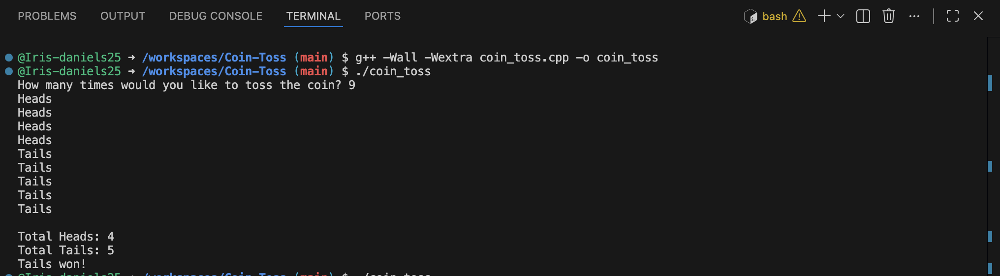

# Coin Toss Simulator (C++)

A simple object-oriented C++ application that simulates repeated coin tosses, tracks outcomes, and displays the final results.

This project was created to practice core C++ programming concepts including classes, constructors, loops, random number generation, and input validation.

---

## Demo



---

## Features

* Simulates an unlimited number of coin tosses
* Tracks total heads and tails
* Displays final statistics
* Determines the winning side
* Validates user input to prevent invalid toss counts

---

## Technologies Used

* C++
* Object-Oriented Programming (OOP)
* Standard Library

  * `<iostream>`
  * `<cstdlib>`
  * `<ctime>`

---

## Concepts Demonstrated

### Classes and Objects

The application uses a `CoinToss` class to encapsulate:

* Heads count
* Tails count
* Coin toss simulation
* Result reporting

### Random Number Generation

The program uses:

```cpp
rand() % 2 + 1
```

to simulate a random coin flip.

### Input Validation

The program validates user input to ensure a positive number of tosses is entered before running the simulation.

### Loops

A `for` loop is used to perform the requested number of coin tosses.

---

## Example Output

```text
How many times would you like to toss the coin? 5

Heads
Tails
Heads
Heads
Tails

Total Heads: 3
Total Tails: 2

Heads won!
```

---

## How to Run

### Compile

```bash
g++ -Wall -Wextra coin_toss.cpp -o coin_toss
```

### Execute

```bash
./coin_toss
```

---

## Future Improvements

* Add percentages for heads and tails
* Allow multiple simulation rounds
* Track longest streaks
* Export results to a file
* Add a graphical interface

---

## Author

**Iris Daniels**

Computing Student | IT Professional

* LinkedIn: https://www.linkedin.com/in/iris-daniels-m
* Portfolio: https://irisbuilds.tech
